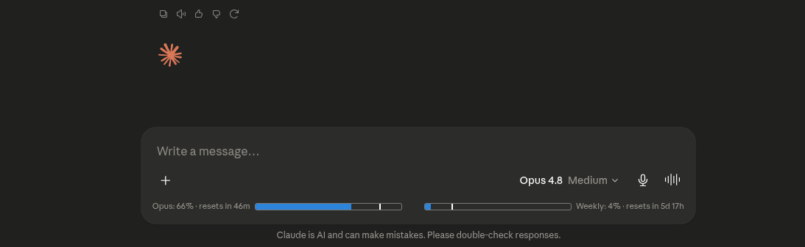
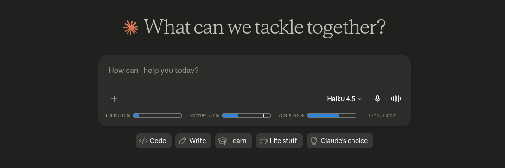

# AI Usage Counter

A minimal browser extension that shows usage bars where your chatbox is — token count, cache timer
and multi-model usage bars on **claude.ai**, plus estimated 5-hour and weekly usage bars on
**gemini.google.com**.

### Existing Conversation

### New Chat (Multi-Model Comparison)

## Claude (claude.ai)

- **Token count** — Approximate token count for the current conversation, with a mini progress bar against the 200k context limit
- **Cache timer** — Countdown showing how long the conversation remains cached (cheaper to continue)
- **Multi-Model Usage Comparison (New Chat)** — On new conversations, view individual 5-hour session usage bars for **Haiku**, **Sonnet**, and **Opus** side-by-side, scaled by relative model consumption rates (Opus 2.0x, Sonnet 1.0x, Haiku 0.33x). Includes a baseline 5-hour rolling window marker line on Sonnet.
- **Dynamic Session & Weekly Bars (Existing Chat)** — Once a model is selected, the bar row dynamically simplifies to display only the active model's 5-hour usage bar alongside the weekly 7-day usage bar at a prominent 200px width each. Both bars include live `"· resets in <duration>"` countdown timers and accurate vertical white window progress markers.
- **Unrounded Precision** — Uses Claude's `/usage` plus live SSE `message_limit` data; the SSE provides exact, unrounded utilization fractions, making progress bars more accurate than the rounded percentages shown on Claude's native `/usage` page.

## Gemini (gemini.google.com)

Two bars sit directly below the Gemini composer, filled with the Gemini brand gradient:

- **5-hour bar** — Since May 2026 Google runs compute-based limits that refresh every 5 hours until you reach a weekly cap. This bar tracks the 5-hour window.
- **Weekly bar** — Tracks the weekly cap that the 5-hour refreshes count against.
- Both carry live `"· resets in <duration>"` countdowns and a vertical marker showing how far through the window you are.
- **Plan selector** — The pill at the right of the row shows your Google AI plan. Click it to cycle **Free → Pro → Ultra**; this rescales the estimated budget. Your choice is remembered.

### ⚠️ Gemini numbers are estimates

Unlike Claude, **Gemini exposes no usage API** — there is nothing to read. So usage is estimated
locally: the extension counts the prompts you send and weights each one by the selected model
(`Flash 1x`, `Pro 4x`, `Thinking 8x`, with surcharges for Deep Research, image and video
generation).

This is a proxy, not a measurement. Google's limits are *compute*-based, so a long chat or a Deep
Research run costs far more than a short prompt, and Google does not publish the underlying budget.
Treat the bars as a rough sense of pace rather than an exact figure — the `est.` label on the plan
pill is there as a reminder.

All weights and budgets live in one block at the top of
[`src/gemini/constants.js`](./src/gemini/constants.js) (`MODEL_WEIGHTS`, `FEATURE_WEIGHTS`,
`TIER_BUDGETS`, `WEEKLY_MULTIPLIER`) so you can recalibrate them against the throttling you actually
hit.

## Installation

**Chrome / Edge / Chromium**

1. Download [`ai-usage-counter-0.6.0.zip`](../../releases/download/v0.6.0/ai-usage-counter-0.6.0.zip)
2. Go to `chrome://extensions` and enable **Developer mode**
3. Drag and drop the zip onto the page

**Firefox**

1. Download [`ai-usage-counter-0.6.0.xpi`](../../releases/download/v0.6.0/ai-usage-counter-0.6.0.xpi)
2. Drag it into any Firefox window and click **Add**

**Userscript**

1. Install the userscript from [`claude-counter.user.js`](./userscript/claude-counter.user.js)

## How it works

**Claude**

- Intercepts Claude's API responses to read conversation data and usage info
- Uses a vendored tokenizer (`o200k_base`) for approximate token counting
- Uses Claude's `/usage` plus live SSE `message_limit` data; the SSE provides exact, unrounded utilization fractions, so the progress bars are more accurate than the rounded percentages shown on Claude's native `/usage` page
- Applies relative model usage multipliers (`Haiku: 0.33x`, `Sonnet: 1.0x`, `Opus: 2.0x`) so 5-hour session usage bars accurately reflect each model's relative consumption rate
- Dynamically switches between a multi-model comparison view on new chats and an active-model + weekly view on existing conversations

**Gemini**

- Detects a sent prompt by watching for Gemini's generate request (`StreamGenerate`), wrapping both `fetch` and `XMLHttpRequest`
- Falls back to the send button / Enter key if Google renames that endpoint, with de-duplication so one prompt is never counted twice
- Reads the model picker to weight each prompt, and accumulates into anchored 5-hour and 7-day windows persisted in local extension storage
- Never contacts Google's APIs itself — it only observes requests the page was already making

**Both** watch for DOM changes and re-inject the UI as you navigate.

## Privacy

- All data stays local — no external servers, no tracking
- On Claude: reads your `lastActiveOrg` cookie to query Claude's `/usage` endpoint; makes requests only to `claude.ai`
- On Gemini: makes **no** network requests at all; it only observes that a request happened, never its contents. Prompt text is never read, stored, or transmitted
- Gemini counters are stored locally via the `storage` permission and never leave your browser

## Credits

- Token counting via [gpt-tokenizer](https://github.com/niieani/gpt-tokenizer) (MIT)
- Inspired by [Claude Usage Tracker](https://github.com/lugia19/Claude-Usage-Extension) by lugia19

## License

MIT
